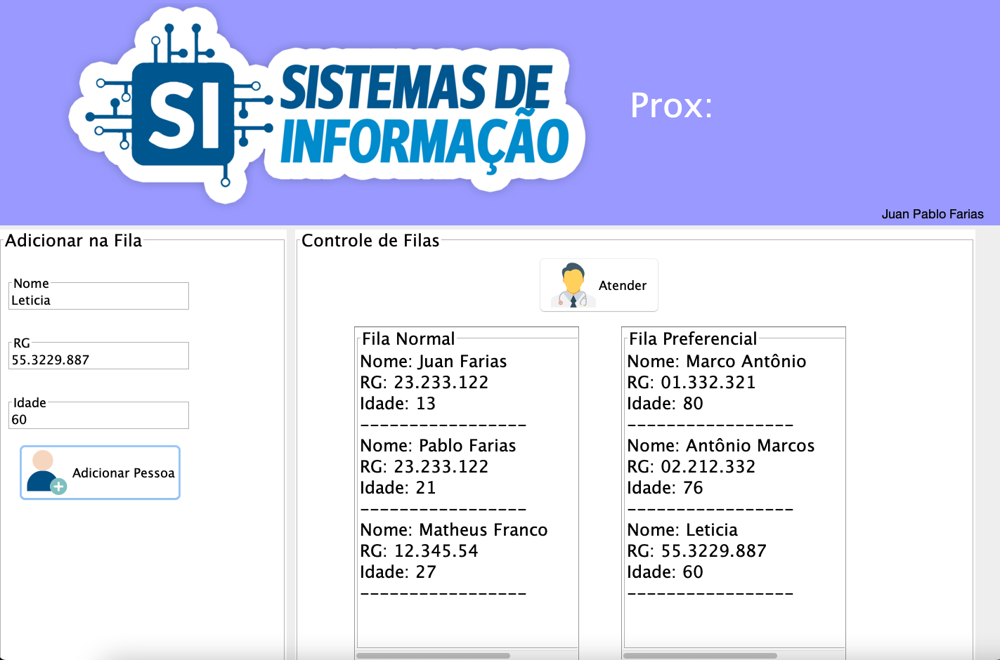

# Controle de Fila de Atendimento

Projeto em Java para aprendizado sobre filas.

## Funcionalidades:

- **Atendimento de Pacientes:** Organiza a fila de atendimento.
- **Verificação da Fila:** Mostra o nome de cada paciente na fila.
- **Prioridade para Pacientes com mais de 60 anos:** A cada três pacientes idosos atendidos, um paciente mais jovem é chamado.

O projeto destaca o aprendizado prático de filas em Java, com foco em uma gestão eficiente e na priorização de pacientes idosos.
